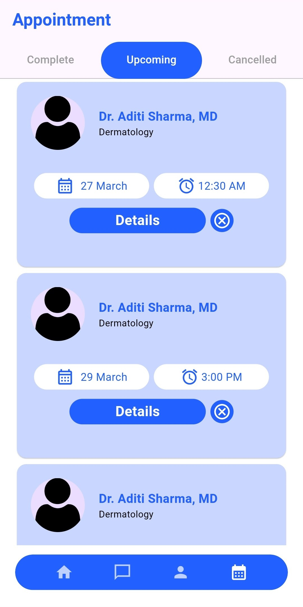

#Skin-First – Dermatology Appointment Booking App

Overview
Skin-First is a user-friendly app that allows patients to book and manage appointments with dermatologists efficiently. Built using Flutter for the frontend and Node.js for the backend, it ensures a seamless experience for both patients and doctors.

##screenshots

###signup page

###auth navigation page

###signup page

###login page

###forgot password page

###home page

###profile page

###upcoming appointment page

###cancelled appointment page

###completed appointment page

###doctor info page

###book appointment page

###review appointment page

Features
✅ User authentication (Sign up, Login)
✅ Browse and search for dermatologists
✅ Book, reschedule, or cancel appointments
✅ View appointment history

Tech Stack
Frontend: Flutter
Backend: Node.js with Express.js
Database: MongoDB 
State Management:  GetX
Authentication: JWT

Installation
Prerequisites
Flutter SDK installed
Node.js and npm installed
MongoDB set up

clone repository
git clone https://github.com/G1-raj/skin-first.git

for flutter app
cd skinfirst
flutter pub get

for node backend
cd skinfirst_backend
npm run dev

## API Endpoints  

| Method | Endpoint | Description |
|--------|---------|-------------|
| POST   | `/user/login` | User login |
| POST   | `/user/signup` | User registration |
| POST   | `/user/doctor/add` | Add a new doctor |
| GET    | `/user/doctor/getall` | Fetch all dermatologists |
| GET    | `/user/doctor/getdoctor/:id` | Fetch a specific doctor by ID |
| POST   | `/user/appointment/:patientId/:doctorId` | Book an appointment |
| GET    | `/user/appointment/getlatest/:patientId` | Fetch the latest upcoming appointment for a patient |
| PATCH  | `/user/update/addprofile/:patientId` | Upload/update user profile |
| GET    | `/user/appointment/cancelled/:patientId` | Get all cancelled appointments for a patient |
| GET    | `/user/appointment/allupcoming/:patientId` | Get all upcoming appointments for a patient |
| PATCH  | `/user/appointment/cancel/:appointmentId` | Cancel an appointment |
